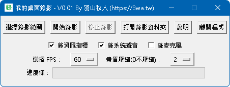
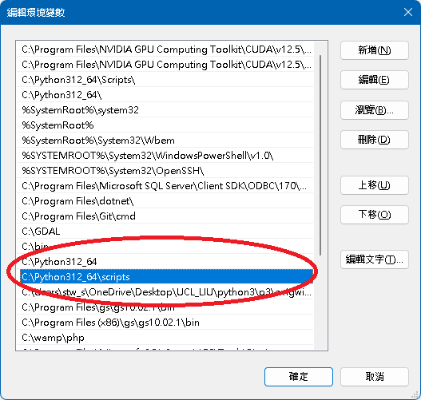

# my_cam_py
我的桌面錄影

用 python 寫的桌面錄影工具

開發動機: 覺得人生是該寫一個桌面錄影，就開始寫了

版本: V0.01
作者: 羽山秋人 (https://3wa.tw)

LICENSE: MIT

使用方法:  
	1. 框選螢幕想錄的範圍
	2. 設定好 fps，通常大概只會選 30 或 60 吧
	3. 壓縮品質，與 png 壓縮品質有關 0 最清晰，建議設 1 或 2
	4. 要錄滑鼠指標嗎 可勾選
	5. 錄系統聲音嗎 可勾選
	6. 要錄麥克風嗎 可勾選
	7. 按下開始錄影即開始
	8. 按下停止錄影，會稍卡一下，按下確定後，會開始進行影片、聲音合併轉檔
	9. 打開資料夾，影片會存在執行程式的 output 目錄

 
程式執行畫面

相依套件: 
	python3.12 x64 位元，建議可安裝在 C:\python312_64 
	將系統路徑 
		PATH 加上 C:\python312_64 
		PATH 加上 C:\python312_64\Scripts 
	 
		
	opencv-python==4.10.0.84
	sounddevice==0.4.7
	soundfile==0.12.1
	scipy==1.14.0
	moviepy==1.0.3
	pydub==0.25.1
	pywin32==306
	pywin32-ctypes==0.2.2
	pyinstaller==6.9.0
	mss (此版羽山有微調 base.py 與 windows.py)
	
	詳見 requirements.txt
	
安裝相關套件: 
	pip install -r requirements.txt

啟動: 
	run.bat
	
編譯成exe: 
	可詳見 build.bat
	如果不想執行時有視窗，可以加上 -w 參數
	
成果範例: 
	https://github.com/shadowjohn/my_cam_py/tree/main/examples
		
	
